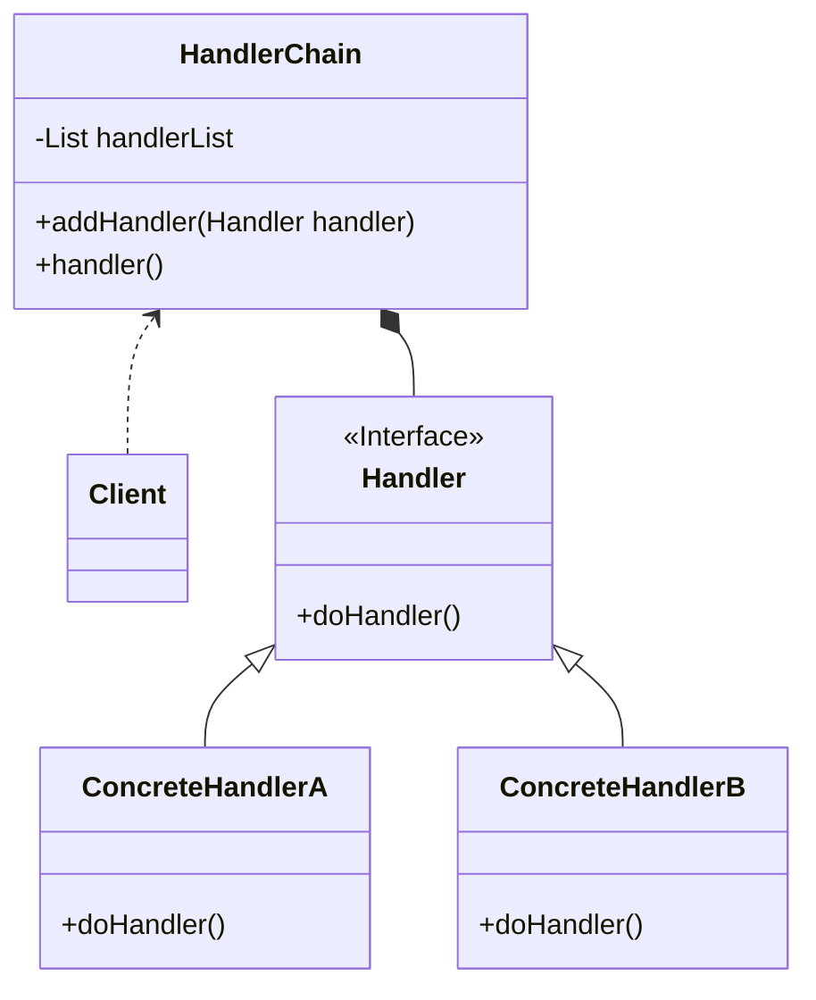
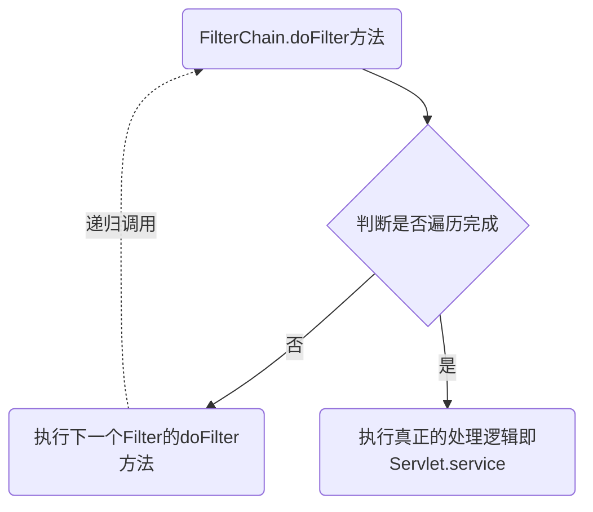

>  参考：
>
>  1. [极客时间-设计模式之美](https://time.geekbang.org/column/intro/100039001) 
>  2. [设计模式的艺术](https://book.douban.com/subject/35163478/) 

## 责任链概念
责任链的英文翻译为：**Chain of Responsibility Design Pattern** ，属于 **行为型模式**

在 GOF 的《设计模式》中的定义原文如下：

> Avoid coupling the sender of a request to its receiver by giving more than one object a chance to handle the request. Chain the receiving objects and pass the request along the chain until an object handles it.

翻译过来就是：将请求的发送和接收解耦，让多个接收对象都有机会处理这个请求。将这些接收对象串成一条链，并沿着该链依次通过这个请求，直到有某个接收对象能够处理这个请求

## 责任链的类图和基本实现
可能大家看到这个概念感觉比较懵，比较难理解，接下来我们看看类图和基本实现来帮助我们理解

它的类图如下所示：


类图里的四种角色的作用：
* **Handler**： Handler 接口定义了处理请求的方法 `doHandler()`
* **ConcreteHandlerA & ConcreteHandlerB**：Handler 接口的实现类，实现了具体的处理请求的逻辑
* **HandlerChain**：HandlerChain 类的作用是将所需要的 Handler 实现类对象串成一条链路，并依次调用。所以封装了 Handler 类型的集合，且定义实现了向集合中添加 Handler 的方法，`handler()` 方法则是具体的循环调用 Handler 集合中的元素的 `doHandler()` 进行处理的方法
* **Client**：客户端负责将所需要的 Handler 实现类对象添加进 HandlerChain 中，并调用 HandlerChain 的 `handler()` 方法进行处理

下面是各个角色的简单实现：
```java
public interface Handler {

	boolean doHandler();
	
}
public class ConcreteHandlerA implements Handler {

	public boolean doHandler() {
		boolean handled = false;
		// ... 处理业务逻辑A
		return handled;
	}
	
}
public class ConcreteHandlerB implements Handler {

	public boolean doHandler() {
		boolean handled = false;
		// ... 处理业务逻辑B
		return handled;
	}
	
}
```

具体处理类中以返回值是否为 true 判断请求是否已经被处理，无需进行后面的遍历

```java
public class HandlerChain {

	private List<Handler> handlerList = new ArrayList<>();
	
	public void addHandler(Handler handler) {
		this.handlerList.add(handler);
	}
	
	public void handler() {
		for(Hanlder handler : handlerList) {
			if (handler.doHandler()) {
				break;
			}
		}
	}
	
}
```

HandlerChain 类实现了将客户端所需的 Handler 串成链依次处理请求的功能

```java
public class Client {
	
	public static void main(String[] args) {
		HandlerChain chain = new HandlerChain();
		chain.addHandler(new ConcreteHandlerA());
		chain.addHandler(new ConcreteHandlerB());
		chain.handle();
	}

}
```

客户端负责创建 HandlerChain 并配置需要的处理对象

在 GOF 的定义中，如果处理链上的某个处理对象能够处理这个请求，那么就不会继续遍历链路往下传递请求了。在我们实际工作中还经常会用到责任链模式的一种 **变体**，即请求会被链路中所有的处理器都处理，不会出现中途终止的情况。
该变体只需要稍稍改动 HandlerChain 的 `handler()` 方法即可

```java
public class HandlerChain {
	
	public void handler() {
		// 循环遍历所有的处理器，不会中途终止
		for(Hanlder handler : handlerList) {
			handler.doHandler();
		}
	}
}

```

## 责任链模式在实际场景中的应用

拿建设智安校园平台举例，平台中用户角色除了校园特有的例如管理员、班主任、教师等角色，还会根据具体的业务增加对应的角色，例如校园安全业务需要新增处理告警事件的安全员角色、宿管业务需要新增宿舍管理员角色、德育考评业务需要新增德育考评老师角色等。

所以判断用户角色的常规写法大概是下面这样：

```java
public class RoleBiz {
    
    public List<Integer> getUserRoles(UserContext UserContext){
        
        List<Integer> roles = new ArrayList<>();
        if (this.isSecurityManagerRole(UserContext)) {
            roles.add(RoleEnum.SECURITY_MANAGER.getValue());
        }
        if (this.isDormManagerRole(UserContext)) {
            roles.add(RoleEnum.DORM_MANAGER.getValue());
        }
        if (this.isEvaluationTeacherRole(UserContext)) {
            roles.add(RoleEnum.EVALUATION_TEACHER.getValue());
        }
        return roles;
        
    }
    
    private boolean isSecurityManagerRole(UserContext UserContext) {
        return securityService.isSecurityManager(UserContext);
    }
    
    private boolean isDormManagerRole(UserContext UserContext) {
        return dormService.isDormManager(UserContext);
    }
                      
    private boolean isEvaluationTeacherRole(UserContext UserContext) {
        return evaluationService.isEvaluationTeacher(UserContext);
    }
              
}
```

但这样的写法不满足开闭原则，因为每新增一种业务角色都要修改 RoleBiz 的代码。

下面我们来看一下责任链模式如何来实现这个需求

RoleHandler 接口定义了判断是否具有角色方法 `isRole(UserContext UserContext)` 以及获取角色类型的方法 `getRoleType()`。各个角色处理器类通过实现这个接口来填充具体的业务判断逻辑

```java
/**
 * 角色处理器接口
 */
public interface RoleHandler {

    /**
     * 是否具有角色
     *
     * @return 是否
     */
    Boolean isRole(UserContext UserContext);

    /**
     * 获取角色类型
     *
     * @return 角色枚举
     */
    RoleEnum getRoleType();

}

/**
 * 安全管理员角色处理器实现类
 */
public class SecurityManagerRoleHandler implements RoleHandler {
    
    public Boolean isRole(UserContext userContext) {
        return securityService.isSecurityManager(userContext);
    }
    
    public RoleEnum getRoleType() {
        return RoleEnum.SECURITY_MANAGER;
    }
}

/**
 * 宿舍管理员角色处理器实现类
 */
public class DormManagerRoleHandler implements RoleHandler {
    
    public Boolean isRole(UserContext userContext) {
        return dormService.isDormManager(userContext);
    }
    
    public RoleEnum getRoleType() {
        return RoleEnum.DORM_MANAGER;
    }
}

/**
 * 考评教师角色处理器实现类
 */
public class EvaluationTeacherRoleHandler implements RoleHandler {
    
    public Boolean isRole(UserContext userContext) {
        return evaluationService.isEvaluationTeacher(userContext);
    }
    
    public RoleEnum getRoleType() {
        return RoleEnum.EVALUATION_TEACHER;
    }
}
```

RoleBiz 承担了将各个角色处理器对象组合成链并封装遍历获取的逻辑，且对外提供获取用户角色集合的接口。即责任链模式类图中 HandlerChain 的功能和 Client 功能的结合

```java
@Component
public class RoleBiz {
    
    // List集合作为处理器链
    private final List<RoleHandler> roleHandlers;

    // 使用Spring自动注入使所有RoleHandler接口的实现了都注入到该集合中
    public RoleBiz(List<RoleHandler> roleHandlers) {
        this.roleHandlers = roleHandlers;
    }

    /**
     * 获取用户的角色列表
     */
    public List<Integer> getUserRoles(UserContext userContext) {

        List<Integer> roleList = new ArrayList<>();
        // 遍历RoleHandler集合
        for (RoleHandler roleHandler : roleHandlers) {
            if (roleHandler.isRole(userContext)) {
                roleList.add(roleHandler.getRoleType().getValue());
            }
        }
        return roleList;
    }
}
```

因为获取用户角色列表这个业务场景的需求就是所有的角色都要判断，所以上面的实现有两个地方和标准的责任链定义不一样

* 使用了 Spring 自动注入，将所有 RoleHandler 接口的实现类都注入到处理器链中
* 遍历所有的处理对象，不会中途终止

这样实现的好处是如果我们需要新增一个角色，只需要新增一个 RoleHandler 接口的实现类即可，不需要改动之前的代码。让代码满足了开闭原则，提高了代码的扩展性

除了上述的例子，责任链模式常见的使用场景还有 **审批处理** 以及 [极客时间-设计模式之美](https://time.geekbang.org/column/intro/100039001) 中举的 **敏感词过滤** 等

## 责任链模式在框架中的应用

责任链常用在框架的开发当中，为框架提供扩展点，让框架的使用者在不修改源码的情况下，基于扩展点添加新的功能。更具体的说，责任链最常用来开发框架中的过滤器和拦截器，例如 Servlet Filter 和 Spring Interceptor 这两个 Java 开发中最常用的组件，下面我们就来看看责任链在 Servlet Filter 中的应用

> Servlet Filter 是 Java Servlet 规范中定义的组件，Filter 翻译成中文就是过滤器，它可以实现对 HTTP 请求的过滤功能，比如鉴权、限流、记录日志、验证参数等等。因为它是 Servlet 规范的一部分，所以只要是支持 Servlet 的 Web 容器（例如 Tomcat、Jetty 等）都支持过滤器功能

下面这段代码是实际项目中实现 Filter 的一个示例，UserContextFilter 类实现了 Filter 接口，Filter 接口共定义了三个方法，其中 `init(FilterConfig filterConfig)` 和 `destroy()` 这两个方法是在 Filter 实现类初始化和销毁的时候执行的，`doFilter(ServletRequest servletRequest, ServletResponse servletResponse, FilterChain filterChain)` 方法则是我们真正实现过滤逻辑的地方。在下面的示例中，过滤的逻辑是判断当请求是 HTTP 请求时，根据 Token 解析用户信息并保存在 ThreadLocal 中，且在 Servlet 处理完请求后清除 ThreadLocal 中的用户信息，防止内存泄露。**需要特别注意的是，`doFilter()` 方法参数中除了 ServletRequest 和 ServletResponse 外还有 FilterChain 对象，而我们在执行完对请求参数的处理后也是调用 FilterChain 类对象的 `doFilter()` 方法继续往下执行的**

`WebFilter` 注解则用来声明该类是 Filter 的实现，需要被容器加入到 FilterChain 中。其中 filterName 变量是该过滤器的唯一标识，value 或 UrlPattens 变量是该过滤器的 URL 匹配模式，只有符合该模式的请求才会被该过滤器处理

```java
@WebFilter(filterName = "UserContextFilter", value = {"/web/*"})
public class UserContextFilter implements Filter {

    @Override
    public void init(FilterConfig filterConfig) {}

    @Override
    public void doFilter(ServletRequest servletRequest, ServletResponse servletResponse,
        FilterChain filterChain) throws IOException, ServletException {
        boolean isHttp = false;
        if (servletRequest instanceof HttpServletRequest) {
            isHttp = true;
            HttpServletRequest httpServletRequest = (HttpServletRequest) servletRequest;
            Map<String, String> queryParameterMap = getUrlParams(
                httpServletRequest.getQueryString());
            String token = queryParameterMap.get("operUserRoleTypes");
            UserContext userContext = this.parseToken(token);
            UserContext.set(userContext);
        }
        try {
            filterChain.doFilter(servletRequest, servletResponse);
        } finally {
            if (isHttp) {
                UserContext.remove();
            }
        }
    }

    @Override
    public void destroy() {}
}
```

根据上面代码我们可以看出，添加过滤器非常方便，不需要修改框架中的任何代码，只需要新增一个 Filter 接口的实现类，再使用注解声明一下即可，完全符合开闭原则。

结合我们前面画的责任链的类图，不难看出，Filter 接口承担的是 Handler 接口的角色，我们实现的 UserContextFilter 类对应的具体的实现类即 ConcreteHandlerA 的角色，而类图中的 HandlerChain 角色在 Tomcat 中对应的是 ApplicationFilterChain 实现类，该类实现了 Servlet 中的 FilterChain 接口，FilterChain 接口只有一个方法 `doFilter(ServletRequest request, ServletResponse response)`。下面是简化逻辑后的 ApplicationFilterChain 代码：

```java
public final class ApplicationFilterChain implements FilterChain {

    // 该数组用于将Filter串成链
    private ApplicationFilterConfig[] filters = new ApplicationFilterConfig[0];
    // 当前遍历Filter数组的下标
    private int pos = 0;
    // filter链的总长度
    private int n = 0;
    // filter链扩容的长度
    public static final int INCREMENT = 10;
    // 实际执行Servlet实例
    private Servlet servlet;
    
    @Override
    public void doFilter(ServletRequest request, ServletResponse response)
        throws IOException, ServletException {
        internalDoFilter(request, response);
    }

    // doFilter真正执行的方法
    private void internalDoFilter(ServletRequest request, ServletResponse response)
        throws IOException, ServletException {
		// 判断Filter数组是否遍历完成
        if (pos < n) {
            ApplicationFilterConfig filterConfig = filters[pos++];
            Filter filter = filterConfig.getFilter();
            filter.doFilter(request, response, this);
            return;
        }
        // 遍历完成后执行真正的处理逻辑
        servlet.service(request, response);
    }

    // 新增Filter实现类的方法
    void addFilter(ApplicationFilterConfig filterConfig) {
        for (ApplicationFilterConfig filter : filters) {
            if (filter == filterConfig) {
                return;
            }
        }
        if (n == filters.length) {
            ApplicationFilterConfig[] newFilters = new ApplicationFilterConfig[n + INCREMENT];
            System.arraycopy(filters, 0, newFilters, 0, n);
            filters = newFilters;
        }
        filters[n++] = filterConfig;
    }
}
```

结合我们 ApplicationFilterChain 中 `doFilter(ServletRequest request, ServletResponse response)` 方法和我们自定义 UserContextFilter 类的`doFilter(ServletRequest servletRequest, ServletResponse servletResponse,
        FilterChain filterChain)`方法的逻辑，我们可以看出，循环遍历 Filter 数组的逻辑是由这两个方法共同实现的，实际上是一个递归调用。下面是一个简单的递归调用示意图（感觉不太贴切，但是能力有限只能画这样了~）



这样的好处是可以在一个方法里同时支持双向拦截，既能拦截客户端发过来的请求，也能拦截服务端的响应

## 责任链总结

职责链模式常用在框架开发中，用来实现框架的过滤器、拦截器功能，让框架的使用者在不需要修改框架源码的情况下，添加新的过滤拦截功能。这也体现了之前讲到的对扩展开放、 对修改关闭的设计原则。

另外尽管我们有给出职责链模式的经典代码实现，但在实际的开发中，我们还是要具体问题具体对待，代码实现会根据不同的需求有所变化。实际上，这一点对于所有的设计模式都适用。


