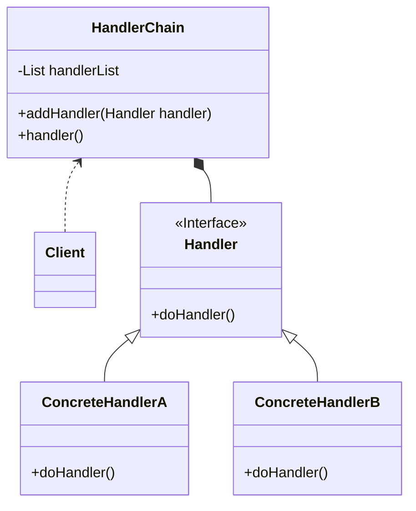

>  参考：
>
>  1. [极客时间-设计模式之美](https://time.geekbang.org/column/intro/100039001) 
>  2. [设计模式的艺术](https://book.douban.com/subject/35163478/) 

## 责任链概念
责任链的英文翻译为：**Chain of Responsibility Design Patten** ，属于 **行为型模式**

在 GOF 的《设计模式》中的定义原文如下：

> Avoid coupling the sender of a request to its receiver by giving more than one object a chance to handle the request. Chain the receiving objects and pass the request along the chain until an object handles it.

翻译过来就是：将请求的发送和接收解耦，让多个接收对象都有机会处理这个请求。将这些接收对象串成一条链，并沿着该链依次通过这个请求，直到有某个接收对象能够处理这个请求

## 责任链的类图和基本实现
可能大家看到这个概念感觉比较懵，比较难理解，接下来我们看看类图和基本实现来帮助我们理解

它的类图如下所示：


类图里的四种角色的作用：
* **Handler**： Handler 接口定义了处理请求的方法 `doHandler()`
* **ConcreteHandlerA & ConcreteHandlerB**：Handler 接口的实现类，实现了具体的处理请求的逻辑
* **HandlerChain**：HandlerChain 类的作用是将所需要的 Handler 实现类对象串成一条链路，并依次调用。所以封装了 Handler 类型的集合，且定义实现了向集合中添加 Handler 的方法，`handler()` 方法则是具体的循环调用 Handler 集合中的元素的 `doHandler()` 进行处理的方法
* **Client**：客户端负责将所需要的 Handler 实现类对象添加进 HandlerChain 中，并调用 HandlerChain 的 `handler()` 方法进行处理

下面是各个角色的简单实现：
```java
public interface Handler {

	boolean doHandler();
	
}
public class ConcreteHandlerA implements Handler {

	public boolean doHandler() {
		boolean handled = false;
		// ... 处理业务逻辑A
		return handled;
	}
	
}
public class ConcreteHandlerB implements Handler {

	public boolean doHandler() {
		boolean handled = false;
		// ... 处理业务逻辑B
		return handled;
	}
	
}
```

具体处理类中以返回值是否为 true 判断请求是否已经被处理，无需进行后面的遍历

```java
public class HandlerChain {

	private List<Handler> handlerList = new ArrayList<>();
	
	public void addHandler(Handler handler) {
		this.handlerList.add(handler);
	}
	
	public void handler() {
		for(Hanlder handler : handlerList) {
			if (handler.doHandler()) {
				break;
			}
		}
	}
	
}
```

HandlerChain 类实现了将客户端所需的 Handler 串成链依次处理请求的功能

```java
public class Client {
	
	public static void main(String[] args) {
		HandlerChain chain = new HandlerChain();
		chain.addHandler(new ConcreteHandlerA());
		chain.addHandler(new ConcreteHandlerB());
		chain.handle();
	}

}
```

客户端负责创建 HandlerChain 并配置需要的处理对象

在 GOF 的定义中，如果处理链上的某个处理对象能够处理这个请求，那么就不会继续遍历链路往下传递请求了。在我们实际工作中还经常会用到责任链模式的一种 **变体**，即请求会被链路中所有的处理器都处理，不会出现中途终止的情况。
该变体只需要稍稍改动 HandlerChain 的 `handler()` 方法即可

```java
public class HandlerChain {
	
	public void handler() {
		// 循环遍历所有的处理器，不会中途终止
		for(Hanlder handler : handlerList) {
			handler.doHandler();
		}
	}
}

```

## 责任链模式在实际场景中的应用

拿建设智安校园平台举例，平台中用户角色除了校园特有的例如管理员、班主任、教师等角色，还会根据具体的业务增加对应的角色，例如校园安全业务需要新增处理告警事件的安全员角色、宿管业务需要新增宿舍管理员角色、德育考评业务需要新增德育考评老师角色等。

所以判断用户角色的常规写法大概是下面这样：

```java
public class RoleBiz {
    
    public List<Integer> getUserRoles(UserContext UserContext){
        
        List<Integer> roles = new ArrayList<>();
        if (this.isSecurityManagerRole(UserContext)) {
            roles.add(RoleEnum.SECURITY_MANAGER.getValue());
        }
        if (this.isDormManagerRole(UserContext)) {
            roles.add(RoleEnum.DORM_MANAGER.getValue());
        }
        if (this.isEvaluationTeacherRole(UserContext)) {
            roles.add(RoleEnum.EVALUATION_TEACHER.getValue());
        }
        return roles;
        
    }
    
    private boolean isSecurityManagerRole(UserContext UserContext) {
        return securityService.isSecurityManager(UserContext);
    }
    
    private boolean isDormManagerRole(UserContext UserContext) {
        return dormService.isDormManager(UserContext);
    }
                      
    private boolean isEvaluationTeacherRole(UserContext UserContext) {
        return evaluationService.isEvaluationTeacher(UserContext);
    }
              
}
```

但这样的写法不满足开闭原则，因为每新增一种业务角色都要修改 RoleBiz 的代码。

下面我们来看一下责任链模式如何来实现这个需求

RoleHandler 接口定义了判断是否具有角色方法 `isRole(UserContext UserContext)` 以及获取角色类型的方法 `getRoleType()`。各个角色处理器类通过实现这个接口来填充具体的业务判断逻辑

```java
/**
 * 角色处理器接口
 */
public interface RoleHandler {

    /**
     * 是否具有角色
     *
     * @return 是否
     */
    Boolean isRole(UserContext UserContext);

    /**
     * 获取角色类型
     *
     * @return 角色枚举
     */
    RoleEnum getRoleType();

}

/**
 * 安全管理员角色处理器实现类
 */
public class SecurityManagerRoleHandler implements RoleHandler {
    
    public Boolean isRole(UserContext userContext) {
        return securityService.isSecurityManager(userContext);
    }
    
    public RoleEnum getRoleType() {
        return RoleEnum.SECURITY_MANAGER;
    }
}

/**
 * 宿舍管理员角色处理器实现类
 */
public class DormManagerRoleHandler implements RoleHandler {
    
    public Boolean isRole(UserContext userContext) {
        return dormService.isDormManager(userContext);
    }
    
    public RoleEnum getRoleType() {
        return RoleEnum.DORM_MANAGER;
    }
}

/**
 * 考评教师角色处理器实现类
 */
public class EvaluationTeacherRoleHandler implements RoleHandler {
    
    public Boolean isRole(UserContext userContext) {
        return evaluationService.isEvaluationTeacher(userContext);
    }
    
    public RoleEnum getRoleType() {
        return RoleEnum.EVALUATION_TEACHER;
    }
}
```

RoleBiz 承担了将各个角色处理器对象组合成链并封装遍历获取的逻辑，且对外提供获取用户角色集合的接口。即责任链模式类图中 HandlerChain 的功能和 Client 功能的结合

```java
@Component
public class RoleBiz {
    
    // List集合作为处理器链
    private final List<RoleHandler> roleHandlers;

    // 使用Spring自动注入使所有RoleHandler接口的实现了都注入到该集合中
    public RoleBiz(List<RoleHandler> roleHandlers) {
        this.roleHandlers = roleHandlers;
    }

    /**
     * 获取用户的角色列表
     */
    public List<Integer> getUserRoles(UserContext userContext) {

        List<Integer> roleList = new ArrayList<>();
        // 遍历RoleHandler集合
        for (RoleHandler roleHandler : roleHandlers) {
            if (roleHandler.isRole(userContext)) {
                roleList.add(roleHandler.getRoleType().getValue());
            }
        }
        return roleList;
    }
}
```

因为获取用户角色列表这个业务场景的需求就是所有的角色都要判断，所以上面的实现有两个地方和标准的责任链定义不一样

* 使用了 Spring 自动注入，将所有 RoleHandler 接口的实现类都注入到处理器链中
* 遍历所有的处理对象，不会中途终止

这样实现的好处是如果我们需要新增一个角色，只需要新增一个 RoleHandler 接口的实现类即可，不需要改动之前的代码。让代码满足了开闭原则，提高了代码的扩展性

除了上述的例子，责任链模式常见的使用场景还有 **审批处理** 以及 [极客时间-设计模式之美](https://time.geekbang.org/column/intro/100039001) 中举的 **敏感词过滤** 等

## 责任链模式在框架中的应用
