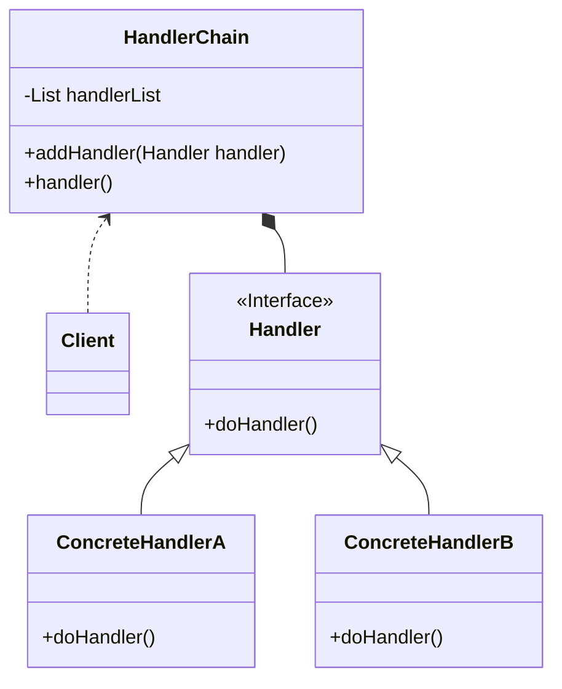

>  参考：
>
>  1. [极客时间-设计模式之美](https://time.geekbang.org/column/intro/100039001) 
>  2. [设计模式的艺术](https://book.douban.com/subject/35163478/) 

## 责任链概念
责任链的英文翻译为：**Chain of Responsibility Design Patten** ，属于 **行为型模式**

在 GOF 的《设计模式》中的定义原文如下：

> Avoid coupling the sender of a request to its receiver by giving more than one object a chance to handle the request. Chain the receiving objects and pass the request along the chain until an object handles it.

翻译过来就是：将请求的发送和接收解耦，让多个接收对象都有机会处理这个请求。将这些接收对象串成一条链，并沿着该链依次通过这个请求，直到有某个接收对象能够处理这个请求

## 责任链的类图和基本实现
可能大家看到这个概念感觉比较懵，比较难理解，接下来我们看看类图和基本实现来帮助我们理解

它的类图如下所示：


类图里的四种角色的作用：
* **Handler**： Handler 接口定义了处理请求的方法 `doHandler()`
* **ConcreteHandlerA & ConcreteHandlerB**：Handler 接口的实现类，实现了具体的处理请求的逻辑
* **HandlerChain**：HandlerChain 类的作用是将所需要的 Handler 串成一条链路，并依次调用。所以封装了 Handler 类型的集合，且定义实现了向集合中添加 Handler 的方法，`handler()` 方法则是具体的循环调用 Handler 集合中的元素的 `doHandler()` 方法
* **Client**：客户端负责将所需要的 Handler 实现了添加进 HandlerChain 中，并调用 HandlerChain 的 `handler()` 方法进行处理

下面是各个角色的简单实现：
```java
public interface Handler {

	boolean doHandler();
	
}
public class ConcreteHandlerA implements Handler {

	public boolean doHandler() {
		boolean handled = false;
		// ... 处理业务逻辑A
		return handled;
	}
	
}
public class ConcreteHandlerB implements Handler {

	public boolean doHandler() {
		boolean handled = false;
		// ... 处理业务逻辑B
		return handled;
	}
	
}
```

具体处理类中以返回值是否为 true 判断请求是否已经被处理，无需进行后面的遍历

```java
public class HandlerChain {

	private List<Handler> handlerList = new ArrayList<>();
	
	public void addHandler(Handler handler) {
		this.handlerList.add(handler);
	}
	
	public void handler() {
		for(Hanlder handler : handlerList) {
			if (handler.doHandler()) {
				break;
			}
		}
	}
	
}
```

HandlerChain 类实现了将客户端所需的 Handler 串成链依次处理请求的功能

```java
public class Client {
	
	public static void main(String[] args) {
		HandlerChain chain = new HandlerChain();
		chain.addHandler(new ConcreteHandlerA());
		chain.addHandler(new ConcreteHandlerB());
		chain.handle();
	}

}
```

客户端负责创建 HandlerChain 并配置需要的处理器

在 GOF 的定义中，如果处理链上的某个处理器能够处理这个请求，那么就不会继续遍历链路往下传递请求了。在我们实际工作中还经常会用到责任链模式的一种变体，即请求会被链路中所有的处理器都处理，不会出现中途终止的情况。
该变体只需要 HandlerChain 的 `handler()`方法稍稍改动即可

```
public class HandlerChain {
	
	public void handler() {
		// 循环遍历所有的处理器，不会中途终止
		for(Hanlder handler : handlerList) {
			handler.doHandler();
		}
	}
}

```

## 责任链模式在实际场景中的应用

​	