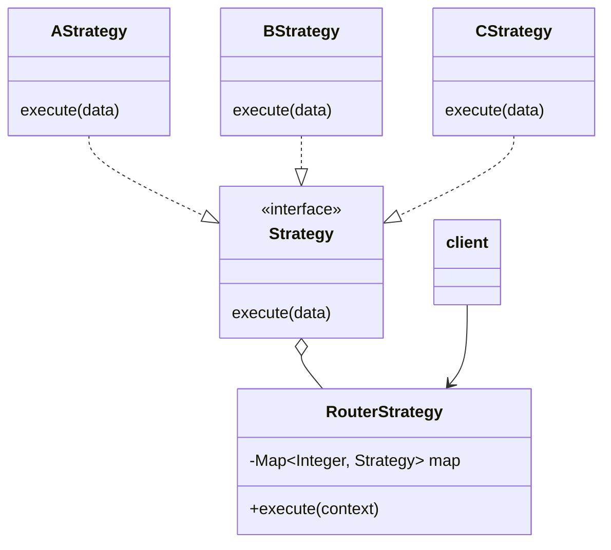

>  参考：
>
>  1. [极客时间-设计模式之美](https://time.geekbang.org/column/intro/100039001) 
>  2. [深入设计模式](https://refactoringguru.cn/design-patterns/book/) 

## 策略模式的概念

策略模式（Strategy Design Pattern）是对象行为型的设计模式，在 GOF 的《设计模式》书中的定义是这样的：

> Define a family of algorithms, encapsulate each one, and make them interchangeable. Strategy lets the algorithm very independently from clients that use it.
>
> 定义一族算法类，将算法类中的每个算法封装起来，并使他们是可替换的。策略模式让算法的变化独立于使用他们的客户端
> 

很多人都知道策略模式可以消除 `if-else` 逻辑，这确实是策略模式的作用之一。不过策略模式最核心的作用还是解耦，它解耦了策略的定义、创建和使用这三部分

## 策略模式类图和角色关系

策略模式的类图如下：



### 策略接口（Strategy）

策略接口定义了所有具体策略类需实现的方法

### 具体策略类（AStrategy）

根据具体策略的不同，维护不同策略的具体实现

### 路由策略类（RouterStrategy）

维护指向具体策略的引用，一般使用查表法消除 `if-else` 逻辑。向使用者提供开放方法，使得使用者无需关注具体策略的创建和使用

### 客户端（client）

调用路由策略类开放的方法，并将方法执行上下文作为参数传递给该方法。客户端无需关注策略的定义、创建和使用

## 策略模式在应用场景中的演化过程

> 设计原则和思想其实比设计模式更加普适和重要，掌握了代码的设计原则和思想，我们甚至可以创造出新的设计模式

### 需求和原始代码

假设我们现在接到一个需求，因为系统建设利旧的需要，我们的管理系统需要兼容不同厂家的车闸产品，我们先看最简单的实现代码：

```java
/**
 * 车闸业务
 */
public class CarBrakeBiz {

    /**
     * 创建固定车
     */
    public Boolean createFixedCar(Integer supplierType, String carId) {
        Boolean result = false;
        if (CAR_BRAKE_SUPPLIER_ENUM.A.getValue() == supplierType) {
            result = this.createFixedCarBySupplierA(carId);
        } else if (CAR_BRAKE_SUPPLIER_ENUM.B.getValue( == supplierType)) {
            result = this.createFixedCarBySupplierB(carId);
        } else if (CAR_BRAKE_SUPPLIER_ENUM.C.getValue() == supplierType) {
            result = this.createFixedCarBySupplierC(carId);
        }
        return result;
    }
    /**
     * 厂商A创建固定车方法
     */
    private boolean createFixedCarBySupplierA(String carId) {
        // ...
        return true;
    }
    /**
     * 厂商B创建固定车方法
     */
    private boolean createFixedCarBySupplierB(String carId) {
        // ...
        return true;
    }
    /**
     * 厂商C创建固定车方法
     */
    private boolean createFixedCarBySupplierC(String carId) {
        // ...
        return true;
    }
}
```

为了避免所有厂商的操作逻辑糅杂在一起，我们分别把每个厂商的操作逻辑抽取为单独的方法，这样更加符合编程规范

如果需求仅仅是这样，那上面的代码也无可厚非。但如果后面需求慢慢增多，除了增加固定车功能，还要增加临时车、增加车辆组、增加车辆通行规则配置等功能，那就会导致 CarBrakeBiz 这个类急剧膨胀且每个方法的逻辑都比较复杂，也就是会导致代可读性和扩展性都比较差

### 代码优化过程

首先为了解决函数过多导致的代码复杂性增加、可读性变差这一问题，我们可以先把操作具体厂商的代码逻辑抽取成职责单一的类。

优化后的代码如下：

```java
public interface CarBrakeStrategy {

    Boolean createFixedCar(String carId);
}

class CarBrakeAStrategy implements CarBrakeStrategy {

    @Override
    public Boolean createFixedCar(String carId) {
        // ...对接逻辑
        return true;
    }
}

class CarBrakeBStrategy implements CarBrakeStrategy {

    @Override
    public Boolean createFixedCar(String carId) {
        // ...对接逻辑
        return true;
    }
}

class CarBrakeCStrategy implements CarBrakeStrategy {

    @Override
    public Boolean createFixedCar(String carId) {
        // ...对接逻辑
        return true;
    }
}

/**
 * 车闸业务
 */
public class CarBrakeBiz {

    /**
     * 创建固定车
     */
    public Boolean createFixedCar(Integer supplierType, String carId) {
        Boolean result = false;
        if (CAR_BRAKE_SUPPLIER_ENUM.A.getValue() == supplierType) {
            result = new CarBrakeAStrategy().createFixedCar(carId);
        } else if (CAR_BRAKE_SUPPLIER_ENUM.B.getValue() == supplierType) {
            result = new CarBrakeAStrategy().createFixedCar(carId);
        } else if (CAR_BRAKE_SUPPLIER_ENUM.C.getValue() == supplierType) {
            result = new CarBrakeAStrategy().createFixedCar(carId);
        }
        return result;
    }
}
```

可以看到经过拆分之后，每个类的代码都不会太多，每个类的逻辑都不太复杂。代码的可读性和可维护性都提高了。除此之外，我们把每个厂商对接的逻辑设计成独立的类，跟具体的业务逻辑进行解耦，这实际就是 **策略模式的第一步：解耦策略的定义**

我们接着往下看优化点会发现，其实每个供应商的具体逻辑类都是无状态的，没有必要每次请求都新创建一个对象来处理，我们可以预先创建好这些对象。

优化后的 CarBrakeBiz 代码如下：

```java
public class CarBrakeBiz {

    private final CarBrakeAStrategy carBrakeAStrategy = new CarBrakeAStrategy();
    private final CarBrakeBStrategy carBrakeBStrategy = new CarBrakeBStrategy();
    private final CarBrakeCStrategy carBrakeCStrategy = new CarBrakeCStrategy();

    /**
     * 创建固定车
     */
    public Boolean createFixedCar(Integer supplierType, String carId) {
        Boolean result = false;
        if (supplierType == CAR_BRAKE_SUPPLIER_ENUM.A.getValue()) {
            result = carBrakeAStrategy.createFixedCar(carId);
        } else if (supplierType == CAR_BRAKE_SUPPLIER_ENUM.B.getValue()) {
            result = carBrakeBStrategy.createFixedCar(carId);
        } else if (supplierType == CAR_BRAKE_SUPPLIER_ENUM.C.getValue()) {
            result = carBrakeCStrategy.createFixedCar(carId);
        }
        return result;
    }
}
```

因为一般来说策略类都是无状态的，所以我们可以提前创建好具体的策略类对象。这实际就是 **策略算法的第二步：解耦策略的创建**

因为策略模式会包含一组策略，在使用它们的时候，一般会通过类型（type）来判断执行哪个具体策略的逻辑，所以我们可以把策略的创建抽取出来。一般来说策略类是无状态的，那么我们可以提前创建好具体的策略对象缓存起来。

不过，在 CarBrakeBiz 代码里还是有一堆的 `if-else` 逻辑，这样如果我们需要新增一个厂商，还是需要修改具体方法中的 `if-else` 逻辑，那我们可以通过查表法来消除掉 `if-else` 逻辑

优化后的 CarBrakeBiz 代码如下：

```java
public class CarBrakeBiz {

    private static final Map<Integer, CarBrakeStrategy> carBrakeStrategyCache = new HashMap<>();

    static {
        carBrakeStrategyCache.put(CAR_BRAKE_SUPPLIER_ENUM.A.getValue(), new CarBrakeAStrategy());
        carBrakeStrategyCache.put(CAR_BRAKE_SUPPLIER_ENUM.B.getValue(), new CarBrakeBStrategy());
        carBrakeStrategyCache.put(CAR_BRAKE_SUPPLIER_ENUM.C.getValue(), new CarBrakeCStrategy());
    }

    /**
     * 创建固定车
     */
    public Boolean createFixedCar(Integer supplierType, String carId) {
        return carBrakeStrategyCache.get(supplierType).createFixedCar(carId);
    }
}
```

因为策略模式会包含一组具体的策略，客户端代码一般是如何确定使用哪个策略呢？最典型的是运行时动态确定使用哪种策略。这里的 **运行时动态确定具体策略类对象** 指的是客户端事先不知道会使用哪个策略，而是在程序运行期间，根据上下文来动态确定使用哪种具体策略，例如上面 CarBrakeBiz 代码中 `createFixedCar()` 方法根据传入的 type 来确定使用哪种具体的策略。**这实际上就是策略算法的第三步：解耦策略的使用**

除了常见的运行时动态确定，另外一种就是在运行前就确定执行哪种策略，代码如下：

```java
public class CarBrakeBiz {

    /**
     * 创建固定车
     */
    public Boolean createFixedCar(CarBrakeStrategy carBrakeStrategy, String carId) {
        return carBrakeStrategy.createFixedCar(carId);
    }

    public static void main(String[] args) {
        CarBrakeAStrategy carBrakeAStrategy = new CarBrakeAStrategy();
        CarBrakeBiz carBrakeBiz = new CarBrakeBiz();
        carBrakeBiz.createFixedCar(carBrakeAStrategy, "浙A0001");
    }
}
```

从上面的代码中我们可以看出非运行时动态确定并不能最大的发挥出策略模式的优势，在这种应用场景下，**策略模式实际上会退化成“面向对象的多态特性”或“基于接口而非实现编程”**。例如我们搜索策略模式在开源框架中的应用时，很多文章会拿 ThreadPoolExecutor 中的拒绝策略 RejectedExecutionHandler 举例子，但 RejectedExecutionHandler 是 ThreadPoolExecutor 的构造参数，所以在创建 ThreadPoolExecutor 时就已经确定，所以我认为它不属于策略模式，而是“面向对象的多态特性”或“基于接口而非实现编程”


