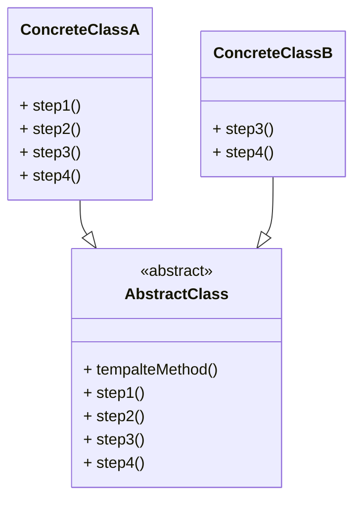

>  参考：
>  1. [极客时间-设计模式之美](https://time.geekbang.org/column/intro/100039001) ：绝大部分设计模式的原理和实现都非常简单，难的是掌握应用场景，搞清楚能解决什么问题。
>  2. [设计模式的艺术](https://book.douban.com/subject/35163478/) 
# 模板方法模式的定义
模板方法模式（Template Method Design Pattern）是一种行为型设计模式，在 GOF 的《设计模式》书中的定义如下：
>  Define the skeleton of an algorithm in an operation, deferring some steps to subclasses. Template method lets subclasses redefine certain steps of an algorithm without changing the algorithm's structure

翻译成中文就是：在模板方法中定义算法的**骨架**，将算法中的某些步骤**推迟**到子类中实现，模板方法可以让子类在不改变算法结构的情况下重新定义某些步骤
这里的算法我们可以理解为实际编程中方法的业务逻辑
**模板方法模式的两大功能：代码复用和功能扩展**
# 模板方法模式的类图和角色


* 抽象类：抽象类中定义模板方法，模板方法只包含算法的骨架，某些步骤的具体实现留给子类去扩展。所以模板方法一般使用 final 修饰，而留给子类实现的步骤一般定义为 abstract，也可以提供默认实现
* 具体实现类：具体实现类可以通过重写模板方法中的步骤来扩展自身的功能
# 模板方法模式的实际应用场景举例
现实需求：我们的应用需要使用钉钉模板发送通知给用户，钉钉接口文档链接：[钉钉开放平台-使用模板发送工作通知消息](https://open.dingtalk.com/document/isvapp/work-notification-templating-send-notification-interface)。结合钉钉文档的同时为了系统的健壮性，我们发送通知的流程大致如下：
1. 通过共通方法获取 access_token
2. 通过共通方法获取当前应用 agent_id
3. 设置钉钉后台通知模板template_id
4. 设置接收用户列表 id
5. 设置钉钉后台模板参数 data
6. 参数校验（用户 id 列表是否为空、模板 id 是否正确、模板参数是否缺少等）
7. 调用钉钉 sdk 发送通知并获取返回结果
8. 发送成功打印日志，发送失败存入数据库供分析
如果我们只是发送一种类型的通知，按照上面的写法是完全可以的。但是系统在功能完善的过程中必然会出现各种各样的通知，例如请假就包含请假、销假、离校、返校等通知。所以在多个通知的实现过程中，如果我们每个通知都复制一遍上述的过程，不仅使得代码冗余、逻辑复杂，还大大的增加了出错的概率。
此时我们可以使用模板方法对这一过程进行改造，将共通方法和逻辑抽取出来组成模板方法，并将每个通知个性化的设置项定义为抽象方法供子类实现。代码 demo 如下：
```java
import java.util.List;  
import java.util.Map;  
import org.apache.commons.collections.CollectionUtils;  
  
public abstract class AbstractDingTemplateTask {  
  
    public final void sendDingTemplateMessage() {  
        // 1.获取accessToken  
        String accessToken = this.getAccessToken();  
        // 2.获取当前应用agent_id  
        String agentId = this.getAgentId();  
        // 3.获取钉钉模板id  
        String templateId = this.getTemplateId();  
        // 4.获取通知人员列表  
        List<String> userIdList = this.getUserIdList();  
        if (CollectionUtils.isEmpty(userIdList)) {  
            return;  
        }  
        String userIdStr = String.join(",", userIdList);  
        Map<String, String> data = this.getData();  
        if (!this.checkParams()) {  
            return;  
        }  
        if (this.sendMessage()) {  
            System.out.println("发送成功");  
        } else {  
            System.out.println("发送失败，保存数据库");  
        }  
    }  
  
    private String getAccessToken() {  
        // 获取accessToken逻辑  
        return "";  
    }  
  
    private String getAgentId() {  
        // 获取agentId逻辑  
        return "";  
    }  
  
    protected abstract String getTemplateId();  
  
    protected abstract List<String> getUserIdList();  
  
    protected abstract Map<String, String> getData();  
  
    private Boolean checkParams() {  
        // 校验userIdList  
        // 校验templateId  
        // 根据templateId获取模板数据校验data  
        return true;  
    }  
  
    private Boolean sendMessage() {  
        // 发送消息逻辑  
        return true;  
    }  
}
```
上面的抽象类中定义了模板方法 `sendDingTemplateMessage()`，该方法定义了发送模板消息的基本逻辑，但是在消息的个性参数获取时定义了抽象方法供具体消息子类实现
```java
import java.util.Collections;  
import java.util.HashMap;  
import java.util.List;  
import java.util.Map;  

public class TypeADingTemplateTask extends AbstractDingTemplateTask{  
      
    @Override  
    protected String getTemplateId() {  
        return DingTemplateEnum.TYPE_A.getDingTemplateId();  
    }  
  
    @Override  
    protected List<String> getUserIdList() {  
        return Collections.singletonList("123");  
    }  
  
    @Override  
    protected Map<String, String> getData() {  
        Map<String, String> data = new HashMap<>();  
        data.put("123", "123");  
        return data;  
    }  
}
```
上面代码演示了类型 A 的模板方法发送的实现类，该类需实现抽象父类中定义的个性化方法，在需要发送消息的时候调用父类的发送方法即可
这样我们将共通逻辑抽取到父类的模板方法中，减少了代码冗余，降低了新建通知类型时出错的概率
# 模板方法模式在框架中的应用举例
前面有提到模板方法的两大功能是代码复用和功能扩展，下面我们就根据这两大功能分别来看看在框架中的应用
## 代码复用
代码复用是在我们日常编程中经常会使用到的一种优化方法，根据我们上面实际场景的例子也可以看到，父类不仅定义了模板方法，还将公共的实现（例如获取 accessToken、校验参数等）抽取出来。下面我们来看 AbstractList 类中使用模板方法代码复用的例子：
```java
public abstract class AbstractList<E> extends AbstractCollection<E> implements List<E> {  

  	public void add(int index, E element) {  
        throw new UnsupportedOperationException();  
    } 
     
  	public boolean addAll(int index, Collection<? extends E> c) {  
		rangeCheckForAdd(index);  
		boolean modified = false;  
		for (E e : c) {  
			add(index++, e);  
			modified = true;  
		}  
		return modified;  
	}  
}
```
在 AbstractList 类中 `addAll()` 方法的角色即为模板方法模式中的模板方法，该方法先是校验传入下标是否符合规范，然后遍历传入集合依次调用 `add()` 方法将元素添加进集合。而 `add()` 方法的实现为抛出异常，即强制子类需先实现 `add()` 方法才能使用 `addAll()` 方法。这样就将 `addAll()` 方法中的校验参数逻辑和遍历逻辑抽取到父类中复用代码
## 功能扩展
这里所说的功能扩展有点类似于[[控制反转]]，在模板方法中有两种表现形式。
一种是子类通过实现父类中定义的某些步骤来完善和增强父类的功能，例如上面我们讲到的发送通知和 AbstractList 两个例子。
还有一种是父类中提前定义好钩子方法，子类通过实现该钩子方法来反向控制父类中模板方法的执行逻辑。例如上面的模板通知的例子，假设现在需要发送重要通知，重要通知无论发送成功与否都要存入数据库。这时候我们可以这样改造 AbstractDingTemplateTask 类：
```java
public final void sendDingTemplateMessage() {  
    // 前面逻辑不变
    if (this.sendMessage() && !this.allSaveDB()) {  
        System.out.println("发送成功");  
    } else {  
        System.out.println("发送失败，保存数据库");  
    }
}

public Boolean allSaveDB(){
	return false;
}
```
上面代码中定义了钩子方法 `allSaveDB()` 并提供了默认实现，即默认通知发送成功不保存到数据库。如果是重要通知我们只需在子类里重写该方法使其返回为 true 即可实现发送成功与否都保存数据库的功能，也即通过修改子类代码反向控制父类代码执行逻辑。